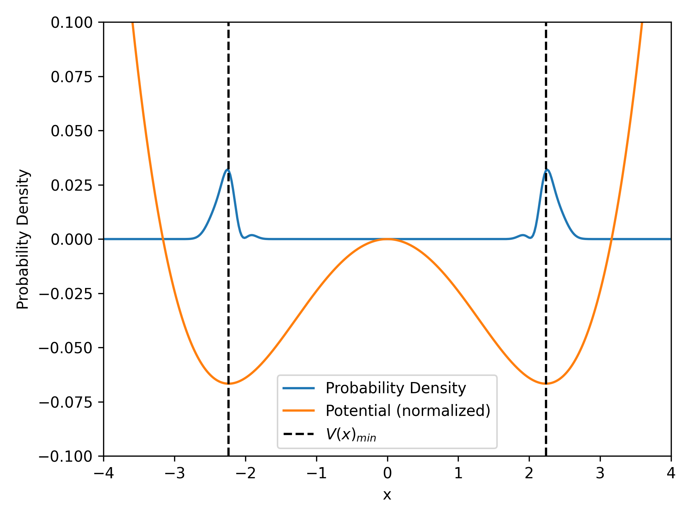

The code to the following instructions can be found here: [GitHub](https://github.com/herzphi/QuantumAnnealing01).

# Quantum Annealing

Recently, I came across quantum annealing, which is a super smart way in utilizing principles of quantum mechanics to solve time intensive analytical problems in a shorter time frame. The script
*ex1_OneDimQuantAnnealing.py*
describes a double well potential with the form 

$$V(x)=x^4-10x^2$$

for which we try to find the ground state. We already know the ground states and only want to demonstrate a possible process.

## Steps to Implement Quantum Annealing
### Define the problem Hamiltonian: 
The Hamiltonian representing the problem to be minimized.
### Define the driver Hamiltonian:
A Hamiltonian that induces quantum fluctuations.
### Interpolate between the driver and problem Hamiltonians:
Use a time-dependent Hamiltonian that gradually switches from the driver to the problem Hamiltonian.
### Solve the Time-Dependent Schrödinger Equation (TDSE):
Use numerical methods to solve the TDSE for the time-dependent Hamiltonian.
### Extract the solution:
Analyze the final state to find the solution to the optimization problem.
### Example:
One-dimensional Quantum Annealing

Let's consider a simple example where we solve for the ground state of a double-well potential using quantum annealing.

1. Define the Hamiltonians

Driver Hamiltonian (transverse field term):
$$H_D = -\Delta \sigma_x$$

Problem Hamiltonian:
$$H_P = V(x)$$
​where $V(x)$ is a double-well-potential.

2. Time-dependent Hamiltonian
$$H(t)=(1-s(t))H_D + s(t)H_P$$

where $s(t)$ is a schedule function that changes from $0$ to $1$ over time.

3. Solve the TDSE

We'll use the Crank-Nicolson method to solve the TDSE numerically.

# Result

The double-well-potential given by $V(x)$ can be seen in orange. the minima can easily calculated to be $x_1=\pm \sqrt{5}$. The probability density $\mid \psi \mid^2$ of the time dependent wave function $\psi(t, x)$ after $1000$ iterations becomes the blue line with the maxima at the minima of the potential. In this case the probability density approaches the ground states of the wave function given the potential $V(x)$.

