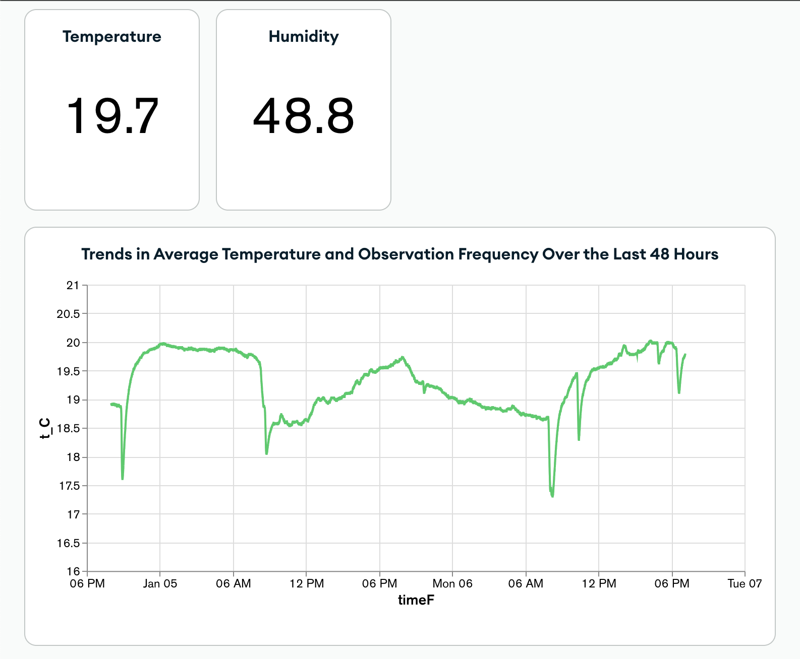

The **Internet of Things (IoT)** revolutionizes how devices interact with each other and their environment. In this post, we explore how to build a robust IoT solution using two core components: a Python backend with `Flask` and MongoDB, and an ESP8266-based sensor system integrated with WiFi.
# The Backend: Flask and MongoDB
The backend is the foundation for receiving, storing, and serving data from IoT devices. Below is an overview of the Python script used. The backend is implemented using `Flask`, a lightweight web framework. It connects to a MongoDB database hosted on MongoDB Atlas for scalable data storage. A **RESTful API endpoint** (/data) processes data sent from IoT devices. The database connection uses a secure URI with password encryption. MongoDB’s flexible schema design supports varying types of data from multiple sensors.

```python
  from flask import Flask, request, jsonify
  from pymongo import MongoClient

  app = Flask(__name__)
  client = MongoClient("mongodb+srv://<credentials>@cluster.mongodb.net/")
  db = client["sensor_database"]

  @app.route('/data', methods=['POST'])
  def receive_data():
      data = request.json
      db["sensor_collection"].insert_one(data)
      return jsonify({"status": "success"}), 200
```
This Flask app listens for incoming JSON payloads and stores them in a MongoDB collection.

## The IoT Device: ESP8266 Sensor System
On the hardware side, we utilize an ESP8266 microcontroller paired with an Adafruit AHT10/AHT20 sensor for temperature and humidity readings. The device sends data to the backend periodically while also displaying it on a 4-digit TM1637 display.

### Libraries Used:

**Adafruit AHTX0:** Handles sensor interactions.<br>
**TM1637Display:** Drives the 4-digit LED display.<br>
**ESP8266WiFi:** Manages WiFi connectivity.<br>
**NTPClient:** Syncs time from an NTP server.<br>

### Key Features:

**WiFi Manager:** Enables dynamic WiFi configuration without hardcoding credentials.<br>
**Time Display**: The TM1637 display alternates between showing the current time, temperature, and humidity.<br>
**REST API Integration**: Sensor readings are sent to the Flask backend as JSON payloads.<br>
### Core Functionalities:
#### Temperature and Humidity Monitoring:
```C
  sensors_event_t humidity, temp;
  aht.getEvent(&humidity, &temp);
  float temperature_C = temp.temperature;
  float humidity_RH = humidity.relative_humidity;
  display.showNumberDec(temperature_C);
```
#### Time Synchronization:
```C
  configTime(gmtOffset_sec, daylightOffset_sec, ntpServer1, ntpServer2);
  time(&now);
  localtime_r(&now, &tm);
```
#### Data Transmission:
```C
  WiFiClient client;
  HTTPClient http;
  http.begin(client, "http://<backend-ip>:<port>/data");
  http.addHeader("Content-Type", "application/json");
  String jsonPayload = "{\"temperature_C\":" + String(temperature_C) + ",\"humidity_RH\":" + String(humidity_RH) + "}";
  http.POST(jsonPayload);
```

The Flask backend receives data every few seconds from the ESP8266 via HTTP POST requests. This enables centralized monitoring and control over multiple IoT devices.

**Step 1:** Deploy the Flask app on a local machine or cloud server. <br>
**Step 2:** Upload the ESP8266 code, ensuring it points to the correct backend IP and port.<br>
**Step 3:** Monitor data in real-time using MongoDB visualization tools or a custom dashboard.

## Applications and Benefits
**Home Automation:** Monitor environmental conditions and control devices.<br>
**Industrial IoT:** Track machine health in real-time.<br>
**Smart Agriculture:** Measure soil and air metrics to optimize crop yields.<br>
**Scalability:** Adding more sensors is straightforward.<br>
**Real-Time Monitoring:** Instantaneous updates from sensors to backend.<br>
**Cost-Effectiveness:** The ESP8266 is a low-cost yet highly capable microcontroller.

<!--  -->

This plot shows an example how the data streamed to the mongoDB can directly be displayed with the insitu chart options.