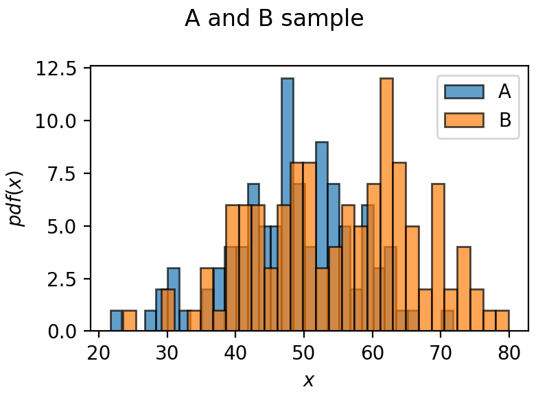
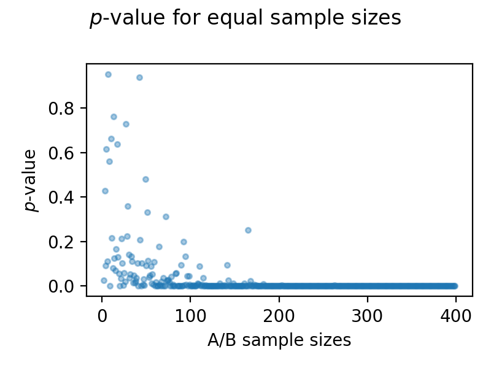

- What is AB test, how is it useful/why is it a good practice?
- Common test statistics
- Example Average revenue per user
  - t distribution
  - two groups A and B with their mean and std
  - calculate t values with Welch and student t test
  - calculate pvalue: t-cdf with t value
  - make a statement

A/B testing is a powerful technique used to compare two versions of a product, webpage, or feature to determine which performs better based on specific metrics. By randomly assigning users to two groups—Group A (control) and Group B (variation)—you can assess the impact of changes objectively. There are several reasons why A/B-testing is valuable: **Data-Driven Decisions**: It replaces guesswork with quantitative evidence. **Improved User Experience**: Helps identify which changes lead to better user satisfaction. **Higher ROI**: Optimizes metrics like conversion rates or average revenue per user (ARPU). **Risk Mitigation**: Tests changes on a small scale before full deployment. To evaluate the results of an A/B test, we use statistical methods, including:

- **Mean** ($\mu$): The average of observed values.
- **Standard Deviation** ($\sigma$): Measures the variability of the observed data.
- **$t$-Value**: A measure of the difference between two group means relative to their variability.
- **$p$-Value**: The probability of observing results as extreme as the test results, assuming the null hypothesis is true.

## Example: Average Revenue Per User (ARPU) Test

After implementing a new feature on a website one can estimate the average revenue per user by comparing the behaviour with and without the new feature. Two groups can lead to the following sample distributions displayed in figure "A and B sample".

- **Group A** (Control): Mean ($\mu_A$) = 50 EUR, Standard Deviation ($σ_A$) = 10 EUR, Sample Size ($n_A$) = 100
- **Group B** (Variation): Mean ($\mu_B$) = 55 EUR, Standard Deviation ($σ_B$) = 12 EUR, Sample Size ($n_B$) = 120

The t-value measures the difference between the two group means relative to their variances. The Welch's t-test formula accounts for unequal variances and can be calculated using

$$t = \frac{\bar{X}_A-\bar{X}_B}{\sqrt{\frac{\sigma_A^2}{n_A}+\frac{\sigma_B^2}{n_B}}} \approx 3.4$$

To get the $p$-value one must calculate the degrees of freedom with
$$dof = \frac{(\frac{\sigma_A^2}{n_A}+\frac{\sigma_B^2}{n_B})^2}{\frac{(\frac{\sigma_A^2}{n_A})^2}{n_A-1}+\frac{(\frac{\sigma_B^2}{n_B})^2}{n_B-1}}\approx217$$

With the degrees of freedom $\nu$ and the t-value $x$ one can calculate the $p$-value which is derived from the cumulative distribution function (CDF) of the t-distribution $f\left(x, \nu\right)$:

$$f\left(x, \nu\right) = \frac{\Gamma\left((\nu+1)/2 \right)}{\sqrt{\pi\nu} \;\Gamma\left(\nu/2 \right)} \left(1+x^2/\nu\right)^{-(\nu+1)/2}$$

the cumulative distribution function is then

$$p-\text{value} = \int_{-\infty}^{x}f\left(t, \nu\right) dt )\approx 0.0004$$

Comparing the $p$-value with the general significance level ($\alpha$ = 0.05) leads to a rejection of the null hypothesis i.e., there is a significant difference between the groups. Of course these outputs are generated from a seed (in my case 42).

Considering the two distributions and increasing the sample sizes equally leads to the following plot, where one could suggest that with increasing sample size (in sample A and in sample B) leads to a smaller $p$-value and therefore to a rejection of the null hypotheses. The means and standard deviations are kept constant from earlier.

 

## Conclusion

A/B testing, supported by statistical analysis, is a cornerstone of modern decision-making. By leveraging tests like Welch’s t-test and evaluating p-values, you can determine the efficacy of changes confidently. Always ensure your sample sizes are adequate and your tests are designed to isolate the variable of interest for reliable results.

